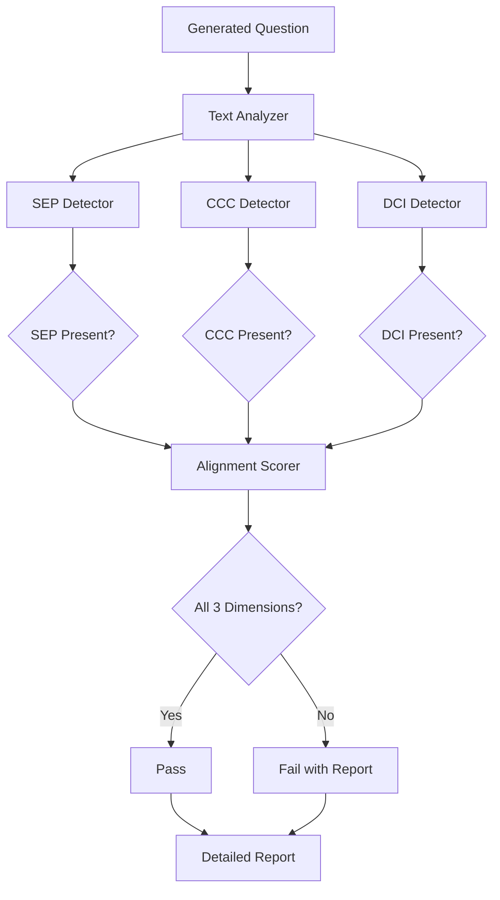

# Story: Build integrated 3D alignment checker

**Story ID**: CC-032  
**Epic**: CC-EPIC-003 (Validation & Quality Assurance)  
**Story Type**: Feature  
**Priority**: Highest  
**Story Points**: 13  
**Status**: To Do  

---

## User Story

As a **quality assurance engineer**, I want to **automatically validate that generated questions align with all three dimensions of learning** so that **we can ensure every question meets NYSSLS 3D framework requirements**.

---

## Description

Build a comprehensive validation system that checks generated questions against all three dimensions (SEP, CCC, DCI) of the NYSSLS framework. The system must analyze question text, identify which dimensions are addressed, and provide a detailed alignment report.

---

## Acceptance Criteria

- [ ] System validates Dimension 1 (SEP) alignment
- [ ] System validates Dimension 2 (CCC) alignment
- [ ] System validates Dimension 3 (DCI) alignment
- [ ] Validation accuracy >95% compared to expert review
- [ ] Generates detailed alignment report for each question
- [ ] Identifies missing or weak dimensional coverage
- [ ] Provides suggestions for improvement
- [ ] Processing time <5 seconds per question
- [ ] API endpoint available for integration

---

## Three-Dimensional Framework

### Dimension 1: Science & Engineering Practices (SEP)
1. Asking Questions and Defining Problems
2. Developing and Using Models
3. Planning and Carrying Out Investigations
4. Analyzing and Interpreting Data
5. Using Mathematics and Computational Thinking
6. Constructing Explanations and Designing Solutions
7. Engaging in Argument from Evidence
8. Obtaining, Evaluating, and Communicating Information

### Dimension 2: Cross-Cutting Concepts (CCC)
1. Patterns
2. Cause and Effect
3. Scale, Proportion, and Quantity
4. Systems and System Models
5. Energy and Matter
6. Structure and Function
7. Stability and Change

### Dimension 3: Disciplinary Core Ideas (DCI)
- PS1: Matter and Its Interactions
- PS2: Motion and Stability: Forces and Interactions
- PS3: Energy
- PS4: Waves and Their Applications
- ESS1: Earth's Place in the Universe

---

## Technical Approach

### Architecture



### Detection Methods

1. **Keyword Matching**: Identify dimension-specific terminology
2. **Semantic Analysis**: Use embeddings to find conceptual alignment
3. **Pattern Recognition**: Identify question structures that indicate dimensions
4. **Context Analysis**: Analyze relationship to standards and stimulus

---

## Technical Tasks

### Sub-tasks

1. **CC-032-01**: Design 3D alignment checker architecture
2. **CC-032-02**: Create dimension keyword dictionaries
3. **CC-032-03**: Build SEP detection algorithm
4. **CC-032-04**: Build CCC detection algorithm
5. **CC-032-05**: Build DCI detection algorithm
6. **CC-032-06**: Implement semantic similarity scoring
7. **CC-032-07**: Create alignment scoring algorithm
8. **CC-032-08**: Build report generation system
9. **CC-032-09**: Create improvement suggestion engine
10. **CC-032-10**: Develop validation API endpoint
11. **CC-032-11**: Build test suite with known good/bad examples
12. **CC-032-12**: Calibrate against expert-reviewed questions
13. **CC-032-13**: Optimize for performance (<5 sec)
14. **CC-032-14**: Create validation dashboard UI component

---

## Validation Logic

### Scoring Algorithm

```python
def calculate_3d_alignment(question, standards):
    sep_score = detect_sep(question)  # 0-1
    ccc_score = detect_ccc(question)  # 0-1
    dci_score = detect_dci(question, standards)  # 0-1
    
    # All three dimensions must be present
    if sep_score > 0.7 and ccc_score > 0.7 and dci_score > 0.7:
        overall_score = (sep_score + ccc_score + dci_score) / 3
        return {
            "aligned": True,
            "overall_score": overall_score,
            "sep": sep_score,
            "ccc": ccc_score,
            "dci": dci_score
        }
    else:
        return {
            "aligned": False,
            "missing_dimensions": identify_missing(sep_score, ccc_score, dci_score)
        }
```

---

## Test Cases

| Test ID | Question Type | Expected SEP | Expected CCC | Expected DCI | Should Pass |
|---------|---------------|--------------|--------------|--------------|-------------|
| TC-032-01 | Calculation | Math/Comp | Energy/Matter | PS3.A | Yes |
| TC-032-02 | Explanation | Constructing | Cause/Effect | PS2.A | Yes |
| TC-032-03 | Data Analysis | Analyzing Data | Patterns | PS4.A | Yes |
| TC-032-04 | Recall Only | None | None | PS3.A | No |
| TC-032-05 | 2D Only | Analyzing Data | None | PS2.A | No |

---

## Output Format

```json
{
  "question_id": "Q1",
  "aligned_3d": true,
  "overall_score": 0.92,
  "dimensions": {
    "sep": {
      "detected": ["Using Mathematics", "Analyzing Data"],
      "score": 0.95,
      "confidence": "high"
    },
    "ccc": {
      "detected": ["Energy and Matter", "Systems and Models"],
      "score": 0.88,
      "confidence": "high"
    },
    "dci": {
      "detected": ["PS3.A: Definitions of Energy"],
      "score": 0.93,
      "confidence": "high"
    }
  },
  "suggestions": [],
  "validation_timestamp": "2025-11-20T23:30:00Z"
}
```

---

## Dependencies

- **Prerequisite**: CC-029, CC-030, CC-031 (Individual dimension validators)
- **Prerequisite**: CC-010 (Knowledge base with dimension mappings)
- **Required**: Embedding model for semantic analysis
- **Required**: Expert-validated question set for calibration

---

## Definition of Done

- [ ] All three dimension detectors functional
- [ ] Validation accuracy >95% on test set
- [ ] API endpoint deployed and documented
- [ ] Performance meets <5 second requirement
- [ ] Integration tests passing
- [ ] Expert review confirms accuracy

---

## Performance Requirements

- **Accuracy**: >95% agreement with expert reviewers
- **Speed**: <5 seconds per question
- **Throughput**: 100+ questions per minute
- **False Positive Rate**: <5%
- **False Negative Rate**: <3%

---

## Notes

- Consider using Gemini 3.0 for semantic analysis of dimensions
- Create a feedback loop to improve detection over time
- May need to adjust thresholds based on question type
- Document edge cases and limitations

---

## Related Stories

- **Depends On**: CC-029 (SEP Validator)
- **Depends On**: CC-030 (CCC Validator)
- **Depends On**: CC-031 (DCI Validator)
- **Blocks**: CC-037 (Generate test questions for all standards)

---

**Created**: November 20, 2025  
**Assigned To**: TBD  
**Reporter**: TBD  
**Labels**: validation, 3d-alignment, epic-3, critical
