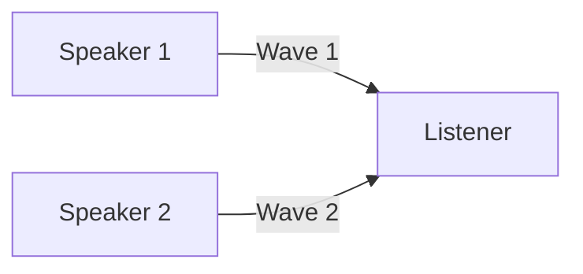

# ClusterCraft Installation Guide for Teachers

**Version 0.1.0**

Welcome to ClusterCraft! This guide will help you install and use ClusterCraft to automatically generate NY State Regents Physics exam questions (called "Clusters") using AI technology.

---

## Table of Contents

1. [What is ClusterCraft?](#what-is-clustercraft)
2. [System Requirements](#system-requirements)
3. [Installation Steps](#installation-steps)
4. [Directory Structure](#directory-structure)
5. [Configuration](#configuration)
6. [Getting Started](#getting-started)
7. [Troubleshooting](#troubleshooting)
8. [Support](#support)

---

## What is ClusterCraft?

ClusterCraft is an AI-powered tool that helps physics teachers create test questions aligned with NY State Regents Physics standards. Given a real-world physics scenario (like "a car braking on wet pavement"), ClusterCraft automatically generates 1-3 exam questions that assess students across three educational dimensions:

- **SEP** (Science & Engineering Practices) - What students *do*
- **CCC** (Cross-Cutting Concepts) - How students *think*
- **DCI** (Disciplinary Core Ideas) - What students *learn*

The tool uses Google's Gemini AI and is designed to be cost-effective (typically $0.05-$0.23 per cluster generation).

---

## System Requirements

- **Operating System**: Windows 10/11, macOS 10.14+, or Linux
- **Disk Space**: Approximately 500 MB
- **Internet Connection**: Required for AI generation
- **Google Gemini API Key**: Free tier available at [Google AI Studio](https://makersuite.google.com/app/apikey)

---

## Installation Steps

### Step 1: Install Python

Python is the programming language ClusterCraft runs on. You need Python 3.8 or newer.

#### Windows:
1. Download Python from [python.org/downloads](https://www.python.org/downloads/)
2. Run the installer
3. **IMPORTANT**: Check the box "Add Python to PATH" during installation
4. Click "Install Now"
5. Verify installation by opening Command Prompt and typing:
   ```cmd
   python --version
   ```
   You should see something like `Python 3.11.x`

#### macOS:
1. Download Python from [python.org/downloads](https://www.python.org/downloads/)
2. Run the `.pkg` installer
3. Follow the installation wizard
4. Verify installation by opening Terminal and typing:
   ```bash
   python3 --version
   ```

#### Linux:
Most Linux distributions come with Python pre-installed. Verify by typing:
```bash
python3 --version
```

If not installed, use your package manager:
```bash
# Ubuntu/Debian
sudo apt update
sudo apt install python3 python3-pip

# Fedora/RHEL
sudo dnf install python3 python3-pip
```

### Step 2: Verify pip Installation

`pip` is Python's package installer. It should be installed automatically with Python.

**Windows:**
```cmd
pip --version
```

**macOS/Linux:**
```bash
pip3 --version
```

If pip is not found, install it:
```bash
python -m ensurepip --upgrade
```

### Step 3: Install ClusterCraft

Navigate to the directory where you extracted ClusterCraft:

**Windows:**
```cmd
cd C:\path\to\physics-rubrics
cd clustercraft
pip install -e .
```

**macOS/Linux:**
```bash
cd /path/to/physics-rubrics
cd clustercraft
pip3 install -e .
```

The `-e` flag installs ClusterCraft in "editable" mode, allowing you to modify templates and configuration without reinstalling.

### Step 4: Obtain a Google Gemini API Key

1. Visit [Google AI Studio](https://makersuite.google.com/app/apikey)
2. Sign in with your Google account
3. Click "Create API Key"
4. Copy your API key (keep it secure!)

### Step 5: Set Your API Key

**Windows Command Prompt:**
```cmd
setx GEMINI_API_KEY "your-api-key-here"
```

**Windows PowerShell:**
```powershell
$env:GEMINI_API_KEY="your-api-key-here"
```

**macOS/Linux (add to ~/.bashrc or ~/.zshrc for persistence):**
```bash
export GEMINI_API_KEY="your-api-key-here"
```

### Step 6: Verify Installation

Test that ClusterCraft is installed correctly:

```bash
clustercraft --help
```

You should see the help menu with available options.

---

## Directory Structure

ClusterCraft includes several directories that work together to generate high-quality physics questions. Here's what each directory contains:

### Core Application Directory

#### `clustercraft/` - Main Application Package
The heart of the application containing all Python code and configuration files.

**Important Files:**
- `cli.py` - Command-line interface for running ClusterCraft
- `orchestrator.py` - Main workflow engine coordinating the generation process
- `search.py` - Finds and loads relevant physics standards
- `llm.py` - Handles communication with Google Gemini AI
- `validator.py` - Ensures generated questions meet quality requirements

**Subdirectories:**
- `config/` - Configuration files (see [Configuration](#configuration) section)
- `templates/` - Customizable prompt templates (see `templates/README.md`)
- `tests/` - Automated tests ensuring ClusterCraft works correctly
- `output/` - Generated clusters are saved here by default
- `.cache/` - Temporary storage to speed up repeated operations

📖 **See `clustercraft/README.md` for technical details**

### Data Directories (Referenced in Configuration)

#### `Physics Teaching Standards/` - NY State Physics Standards
Contains official NY State Learning Standards for Physics organized by topic area.

**Structure:**
- `Energy/` - Standards HS-PS3-1 through HS-PS3-5
- `Forces and Motion/` - Standards HS-PS2-1 through HS-PS2-3
- `Waves and Information/` - Standards HS-PS4-1 through HS-PS4-5
- `Space Systems/` - Standards HS-ESS1-1 through HS-ESS1-6
- `Structure and Properties of Matter/` - Standards HS-PS1-1 through HS-PS1-8
- `NYSSLS Physics Standards.pdf` - Complete standards document

**File Formats:** `.mhtml`, `.pdf`

**🔧 How to Add New Standards:**
1. Download standard documentation from NY State Education Department
2. Save files to appropriate subdirectory (e.g., `Energy/` for HS-PS3-* standards)
3. Use naming convention: `HS-PS#-# — Description.mhtml` or `.pdf`
4. No configuration changes needed - ClusterCraft will automatically find them

#### `Performance Level Descriptors/` - Teaching Context
Contains detailed descriptions of what students should be able to do at different performance levels.

**Contents:**
- `Physics PLDs (1).pdf` - Performance Level Descriptors document

**Purpose:** Provides additional context to help AI generate questions appropriate for different student skill levels.

**🔧 How to Add New PLDs:**
1. Place new PLD documents in this directory
2. Supported formats: `.pdf`, `.txt`, `.md`
3. No configuration changes needed

### Reference Directories

#### `Sample Clusters/` - Example Questions
Contains real NY State Regents Physics exam questions used as reference examples.

**Contents:**
- `sample-physics-clusters-2025.pdf` - Published exam questions
- `sample-physics-clusters-2025.md` - Same questions in markdown format
- `sample-physics-clusters-ratingguide-2025.pdf` - Official grading rubrics

**Purpose:** These examples help the AI understand:
- Expected question format and structure
- Appropriate difficulty level
- How to create grading rubrics

#### `TechRefDocs/` - Technical Research
Contains research papers and documentation about cost optimization strategies.

**Contents:**
- `Reduce-TokenCosts.md` - Summary of token cost reduction strategies
- `You_Do_Not_Need_RAG.pdf` - Research paper on search-first architecture
- `Reducing Token Costs.pdf` - Cost analysis documentation

**Purpose:** Background research that informed ClusterCraft's design. Teachers don't need to read these, but they explain why ClusterCraft uses a "search-first" approach instead of traditional vector databases.

### Planning and Documentation Directories

#### `Plans/` - Project Planning Documents
Contains project planning materials and JIRA tickets for ongoing development.

📖 **See `Plans/AG/AG_JIRAs/README.md` for details**

#### `PoC/` - Proof of Concept Code
Contains early prototype code demonstrating ClusterCraft's feasibility.

**Purpose:** Historical reference showing how the search-first approach was validated before building the full application.

### Root Directory Files

- `README.md` - Project overview and quick start guide
- `LICENSE` - MIT License terms
- `CLAUDE.md` - Detailed codebase documentation
- `INSTALLATION_GUIDE.md` - This document
- `.gitattributes` - Git configuration
- `extract_pdf.py` - Utility script for extracting text from PDFs

---

## Configuration

ClusterCraft's behavior is controlled by a YAML configuration file located at:
```
clustercraft/config/settings.yaml
```

### Understanding the Configuration File

Open `settings.yaml` in any text editor. Here's what each section means:

#### Data Paths
```yaml
data:
  base_path: ".."
  standards_dir: "Physics Teaching Standards"
  pld_dir: "Performance Level Descriptors"
```

- `base_path`: The root directory containing your data (relative to clustercraft folder)
- `standards_dir`: Where physics standards documents are stored
- `pld_dir`: Where Performance Level Descriptors are stored

**🔧 To change data locations:**
1. Move your standards to a new folder
2. Update the `standards_dir` value in `settings.yaml`
3. Save the file

Example - if you created a new folder structure:
```yaml
data:
  base_path: ".."
  standards_dir: "Updated Standards 2026"
  pld_dir: "PLDs 2026"
```

#### Model Configuration
```yaml
model:
  name: "gemini-1.5-flash"
  temperature: 0.7
  max_tokens: 8000
```

- `name`: Which AI model to use (gemini-1.5-flash is cost-optimized)
- `temperature`: Creativity level (0.0 = very focused, 1.0 = more creative)
- `max_tokens`: Maximum length of generated response

**💡 Tip:** Keep `temperature` between 0.6-0.8 for educational content.

#### Search Configuration
```yaml
search:
  extensions:
    - "pdf"
    - "mhtml"
    - "txt"
    - "md"
  enable_cache: true
  cache_dir: ".cache"
```

- `extensions`: File types ClusterCraft will search in
- `enable_cache`: Speed up repeated searches (recommended: true)
- `cache_dir`: Where to store cached data

**🔧 To add support for new file types:**
Add them to the extensions list:
```yaml
extensions:
  - "pdf"
  - "mhtml"
  - "txt"
  - "md"
  - "docx"  # New file type
```

#### Output Configuration
```yaml
output:
  dir: "output"
  format: "markdown"
  include_metadata: true
```

- `dir`: Where generated clusters are saved
- `format`: Output format (currently supports markdown)
- `include_metadata`: Include token costs and standards used

#### Logging
```yaml
logging:
  level: "INFO"
  file: "clustercraft.log"
```

- `level`: How much detail to log (DEBUG, INFO, WARNING, ERROR)
- `file`: Log file name

**🔧 For troubleshooting, change to:**
```yaml
logging:
  level: "DEBUG"
```

---

## Getting Started

### Basic Usage

Generate a cluster with a focus standard and scenario:

```bash
clustercraft --focus-standard "HS-PS-2-1" --stimulus "A car braking on wet pavement transfers kinetic energy to thermal energy through friction."
```

**What happens:**
1. ClusterCraft searches for standard HS-PS-2-1 documents
2. Loads relevant Performance Level Descriptors
3. Sends everything to Google Gemini AI
4. Generates 1-3 questions
5. Validates the output
6. Saves to `clustercraft/output/cluster_YYYYMMDD_HHMMSS.md`

### Using Multiple Standards

Generate a cluster covering multiple related standards:

```bash
clustercraft --focus-standard "HS-PS-3-1" --ancillary-standards "HS-PS-3-2,HS-PS-2-1" --stimulus "A roller coaster converts potential energy to kinetic energy as it descends."
```

### Using a Stimulus File

For longer scenarios with diagrams, tables, or formatted text:

1. Create a markdown file (e.g., `my_scenario.md`)
2. Add your scenario with any Mermaid diagrams or tables
3. Run:

```bash
clustercraft --focus-standard "HS-PS-4-1" --stimulus-file "./my_scenario.md"
```

**Example stimulus file content:**
```markdown
# Wave Interference Scenario

Two sound waves from speakers at a concert create an interference pattern.



The listener hears alternating loud and quiet regions as they move through the room.
```

### Preview Mode (Dry Run)

See what ClusterCraft will send to the AI without actually generating:

```bash
clustercraft --focus-standard "HS-PS-2-1" --stimulus "A scenario" --dry-run
```

This is useful for:
- Checking that the right standards are loaded
- Verifying your stimulus is formatted correctly
- Testing configuration changes

### Verbose Mode

See detailed information about what ClusterCraft is doing:

```bash
clustercraft --focus-standard "HS-PS-2-1" --stimulus "A scenario" --verbose
```

---

## Troubleshooting

### Issue: "clustercraft: command not found"

**Solution:**
1. Make sure you ran `pip install -e .` from the clustercraft directory
2. Try closing and reopening your terminal
3. On Windows, restart after setting environment variables

### Issue: "No API key found"

**Solution:**
1. Verify you set the GEMINI_API_KEY environment variable
2. Check that you didn't include quotes in the actual key value
3. Try setting it again in a new terminal window

### Issue: "No standards found for HS-PS-X-Y"

**Solution:**
1. Check that the standard exists in `Physics Teaching Standards/`
2. Verify the file naming includes the standard code (e.g., `HS-PS3-1`)
3. Make sure `settings.yaml` points to the correct directories

### Issue: "Generated cluster failed validation"

**Solution:**
1. Check the validation errors in the output
2. Try adjusting temperature in `settings.yaml` (try 0.6 or 0.8)
3. Make sure your stimulus clearly describes a physics scenario
4. Verify the standards you selected are compatible

### Issue: "Rate limit exceeded"

**Solution:**
1. You've hit Google's free tier API limits
2. Wait a few minutes and try again
3. Consider upgrading to a paid Gemini API plan for higher limits

### Issue: "Module not found" errors

**Solution:**
```bash
pip install pyyaml jinja2
```

Or reinstall ClusterCraft:
```bash
cd clustercraft
pip install -e .
```

### Getting More Help

1. Check `clustercraft/clustercraft.log` for detailed error messages
2. Enable debug logging in `settings.yaml`:
   ```yaml
   logging:
     level: "DEBUG"
   ```
3. Review `clustercraft/README.md` for additional technical details
4. Check `templates/README.md` if you're customizing prompts

---

## Support

### Documentation
- **Main README**: `README.md` - Project overview
- **Technical Details**: `CLAUDE.md` - Comprehensive codebase documentation
- **Template Customization**: `clustercraft/templates/README.md`
- **Project Planning**: `Plans/AG/AG_JIRAs/README.md`

### Example Files
- Look in `Sample Clusters/` for example questions
- Check `clustercraft/stimuli/` for example stimulus files (if present)

### Cost Information

**Typical Costs per Generation:**
- Single standard (e.g., HS-PS-2-1): ~$0.05
- Multiple related standards: ~$0.09
- Broad topic search: ~$0.23

**Free Tier:** Google Gemini offers a free tier with rate limits. For classroom use, the free tier is usually sufficient.

### Best Practices

1. **Start Simple**: Begin with single standards and short stimuli
2. **Use Dry Run**: Preview prompts before generating to save API credits
3. **Organize Stimuli**: Create a folder for your scenario files
4. **Review Output**: Always review generated clusters for accuracy
5. **Keep Standards Updated**: Periodically check for updated NY State standards
6. **Backup Configurations**: Save copies of `settings.yaml` before making changes

### File Organization Tips

```
physics-rubrics/
├── clustercraft/           # Never modify core files here
│   └── config/
│       └── settings.yaml   # Main configuration - customize this
├── Physics Teaching Standards/  # Add new standards here
│   ├── Energy/
│   ├── Forces and Motion/
│   └── ...
├── Performance Level Descriptors/  # Add new PLDs here
├── my_stimuli/            # Create this for your scenarios
│   ├── energy_scenarios.md
│   ├── force_scenarios.md
│   └── ...
└── generated_clusters/    # Create this for organized output
    ├── 2025-01-energy/
    ├── 2025-01-forces/
    └── ...
```

---

## Quick Reference Card

### Most Common Commands

**Generate with one standard:**
```bash
clustercraft --focus-standard "HS-PS-2-1" --stimulus "Your scenario"
```

**Generate with multiple standards:**
```bash
clustercraft --focus-standard "HS-PS-3-1" --ancillary-standards "HS-PS-3-2" --stimulus "Your scenario"
```

**Use a scenario file:**
```bash
clustercraft --focus-standard "HS-PS-4-1" --stimulus-file "./scenario.md"
```

**Preview without generating:**
```bash
clustercraft --focus-standard "HS-PS-2-1" --stimulus "Your scenario" --dry-run
```

**See detailed output:**
```bash
clustercraft --focus-standard "HS-PS-2-1" --stimulus "Your scenario" --verbose
```

**Get help:**
```bash
clustercraft --help
```

### Available Physics Standards

| Topic Area | Standards |
|------------|-----------|
| Energy | HS-PS3-1, HS-PS3-2, HS-PS3-3, HS-PS3-4, HS-PS3-5 |
| Forces and Motion | HS-PS2-1, HS-PS2-2, HS-PS2-3 |
| Waves and Information | HS-PS4-1, HS-PS4-2, HS-PS4-3, HS-PS4-4, HS-PS4-5 |
| Space Systems | HS-ESS1-1, HS-ESS1-2, HS-ESS1-3, HS-ESS1-4, HS-ESS1-6 |
| Structure/Properties | HS-PS1-1 through HS-PS1-8 |

---

## Updating ClusterCraft

When you receive updates to ClusterCraft:

1. **Backup your customizations:**
   ```bash
   cp clustercraft/config/settings.yaml settings_backup.yaml
   ```

2. **Extract the new version** over the existing installation

3. **Restore your settings:**
   ```bash
   cp settings_backup.yaml clustercraft/config/settings.yaml
   ```

4. **Reinstall:**
   ```bash
   cd clustercraft
   pip install -e .
   ```

---

## Appendix: Understanding Three-Dimensional Assessment

ClusterCraft generates questions that assess students across three dimensions as defined by the Next Generation Science Standards (NGSS):

### Dimension 1: Science & Engineering Practices (SEP)
What students **DO** with their knowledge:
- Asking questions and defining problems
- Developing and using models
- Planning and carrying out investigations
- Analyzing and interpreting data
- Using mathematics and computational thinking
- Constructing explanations and designing solutions
- Engaging in argument from evidence
- Obtaining, evaluating, and communicating information

### Dimension 2: Crosscutting Concepts (CCC)
How students **THINK** about science:
- Patterns
- Cause and effect
- Scale, proportion, and quantity
- Systems and system models
- Energy and matter
- Structure and function
- Stability and change

### Dimension 3: Disciplinary Core Ideas (DCI)
What students **LEARN** (content knowledge):
- Physical sciences core ideas
- Life sciences core ideas
- Earth and space sciences core ideas
- Engineering, technology, and applications of science

Each generated cluster ensures students must demonstrate understanding across all three dimensions.

---

**Version:** 0.1.0
**Last Updated:** November 2024
**License:** MIT License
**For Questions:** See main README.md for contact information
