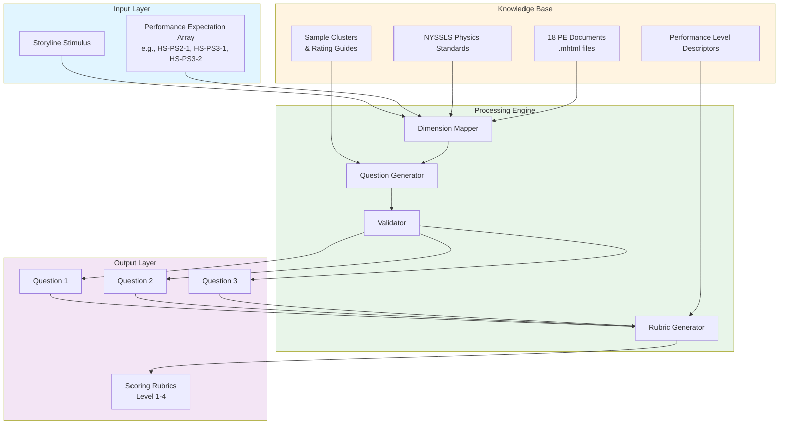
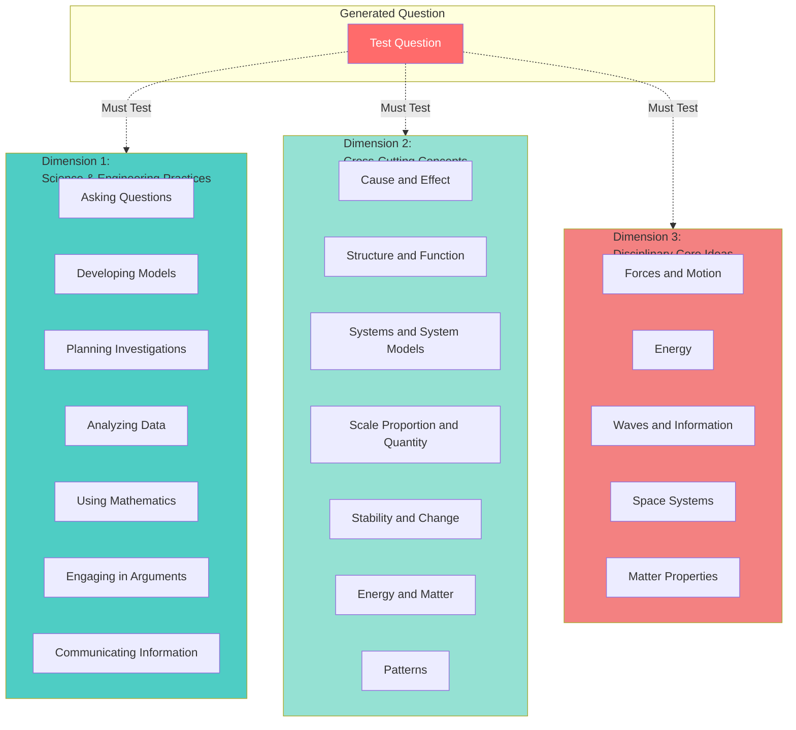
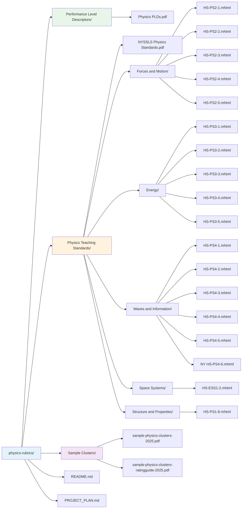
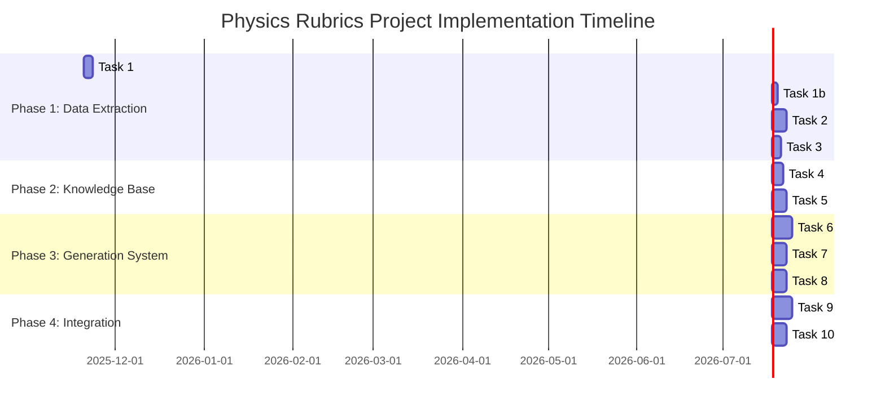
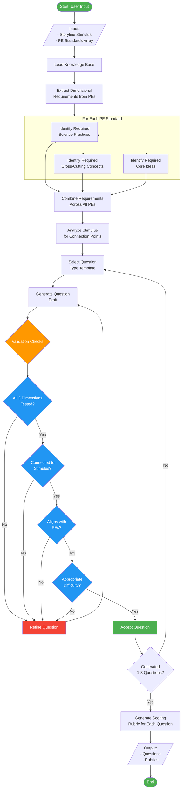
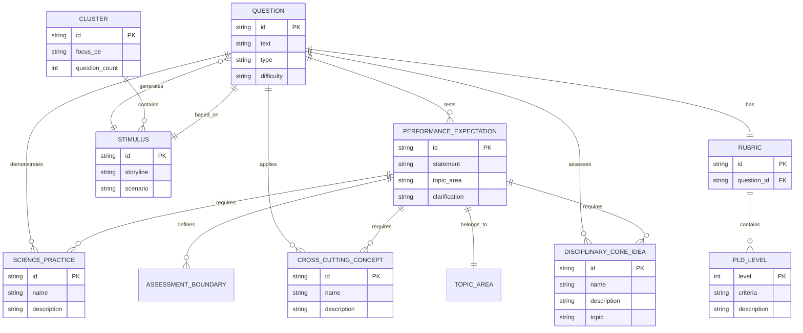
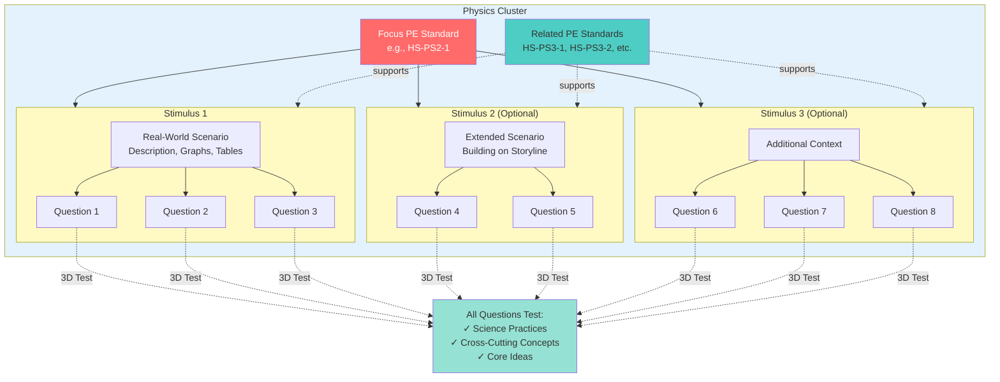
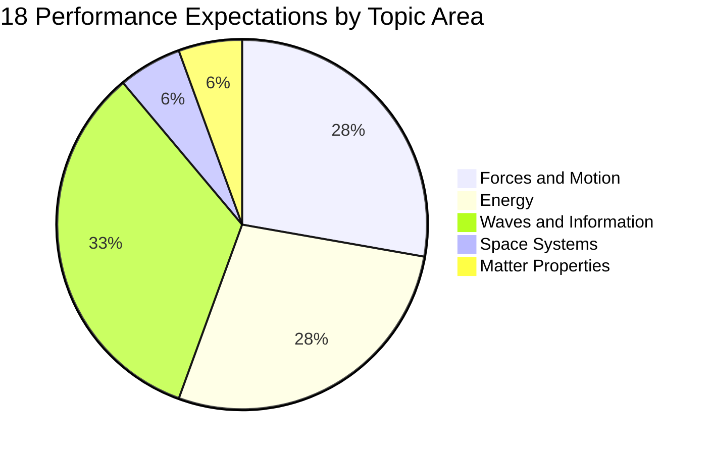

# Physics Rubrics Project - Implementation Plan

## Project Overview

**Goal:** When given the story-line component of a Stimulus and an array of Performance Expectation Standards (e.g., HS-PS2-1, HS-PS3-1, HS-PS3-2), generate 1-3 test questions where each question tests the students' reasoning abilities in each of the 3 reasoning dimension requirements as defined in the Performance Expectation Standards.

**Date Created:** November 20, 2025
**Last Updated:** November 20, 2025

## System Architecture Overview

## Three-Dimensional Assessment Framework

All questions must test student reasoning across three dimensions:

### Dimension 1: Science & Engineering Practices (What Students Do)
- Asking questions
- Developing models
- Planning investigations
- Analyzing Data
- Using Mathematics
- Engaging in arguments
- Communicating Information

### Dimension 2: Cross-Cutting Concepts (How Students Think)
- Cause and Effect
- Structure and Function
- Systems and System Models
- Scale Proportion and Quantity
- Stability and Change
- Energy and Matter
- Patterns

### Dimension 3: Disciplinary Core Ideas (What Students Learn)
- Topic-specific physics concepts from NYSSLS standards

### Three-Dimensional Integration Model

## Current Repository Assets

### 1. NYSSLS Physics Standards (Primary Reference)
- **Location:** `Physics Teaching Standards/NYSSLS Physics Standards.pdf`
- **Content:** Detailed student expectations for NY State Regents Physics
- **Purpose:** Comprehensive standards document defining what students need to learn and demonstrate

### 2. Performance Level Descriptors
- **Location:** `Performance Level Descriptors/Physics PLDs (1).pdf`
- **Content:** NY State requirements (PLDs) defining what students must demonstrate at each performance level (Level 1-4)
- **Purpose:** Provides the grading criteria framework and additional teaching requirements for the NY State Regents Physics course

### 3. Physics Teaching Standards (Detailed Breakdowns)
**Location:** `Physics Teaching Standards/` (organized by topic)

#### Forces and Motion (5 standards)
- HS-PS2-1 through HS-PS2-5

#### Energy (5 standards)
- HS-PS3-1 through HS-PS3-5

#### Waves and Information (6 standards)
- HS-PS4-1 through HS-PS4-5
- NY HS-PS4-6

#### Space Systems (1 standard)
- HS-ESS1-2

#### Structure and Properties of Matter (1 standard)
- HS-PS1-8

**Total:** 18 performance expectation documents (.mhtml files)

**Note:** These .mhtml files break out the student science and engineering practices, describing how students are to demonstrate their understanding of the learned performance expectations.

### 4. Sample Clusters
- **Location:** `Sample Clusters/`
- `sample-physics-clusters-2025.pdf` - 3 example clusters
- `sample-physics-clusters-ratingguide-2025.pdf` - Answer key and grading guidance

### Repository Structure

## Implementation Plan

### Project Phases Timeline

### Phase 1: Data Extraction & Understanding

#### Task 1: Extract and Parse NYSSLS Physics Standards
**Objective:** Parse the primary NYSSLS Physics Standards PDF to extract comprehensive student expectations

**Actions:**
- Extract text from NYSSLS Physics Standards.pdf
- Identify all performance expectations and detailed requirements
- Extract dimensional requirements for each standard
- Create base reference document

**Deliverable:** Structured NYSSLS standards reference document

---

#### Task 1b: Extract and Parse Performance Level Descriptors
**Objective:** Parse the Physics PLDs PDF to extract NY State grading requirements

**Actions:**
- Extract text from Physics PLDs (1).pdf
- Identify Level 1, 2, 3, and 4 criteria
- Map performance levels to assessment requirements
- Create structured data format for PLDs
- Link PLDs to NYSSLS standards

**Deliverable:** Structured PLD reference document/database

---

#### Task 2: Parse All Performance Expectations from MHTML Files
**Objective:** Extract detailed content from all 18 .mhtml files

**Actions:**
- Parse HTML content from .mhtml files
- Extract for each standard:
  - Performance expectation statement
  - Science and engineering practices
  - Disciplinary core ideas
  - Cross-cutting concepts
  - Assessment boundaries
  - Clarification statements
- Organize by topic area

**Deliverable:** Structured database of all 18 performance expectations

---

#### Task 3: Analyze Sample Clusters and Rating Guide
**Objective:** Understand existing cluster structure and 3D assessment patterns

**Actions:**
- Study the 3 sample clusters in detail (sample-physics-clusters-2025.pdf)
- Analyze question formats and types
- Map how each question tests across 3 dimensions
- Understand scoring rubrics from rating guide (sample-physics-clusters-ratingguide-2025.pdf)
- Identify patterns in stimulus-to-question connections
- Document cluster structure:
  - Stimulus sections (1-5 questions per stimulus)
  - Total 6-8 questions per cluster
  - How clusters focus on one core PE while incorporating others
  - How additional scenarios build story-lines

**Deliverable:** Analysis document with question patterns and cluster structure templates

---

### Phase 2: Knowledge Base Construction

#### Task 4: Create Data Models for 3-Dimensional Assessment
**Objective:** Design data structures for the three reasoning dimensions

**Actions:**
- Define schema for Science & Engineering Practices (7 practices)
- Define schema for Cross-Cutting Concepts (7 concepts)
- Define schema for Disciplinary Core Ideas (topic-specific)
- Create mapping structure between performance expectations and dimensions
- Design relationship model showing how dimensions interact

**Deliverable:** Data model documentation and schemas

---

#### Task 5: Build Performance Expectation Knowledge Base
**Objective:** Create comprehensive, structured database of all standards

**Actions:**
- Organize all 18 performance expectations by topic
- Map each PE to its dimensional components:
  - Associated science practices
  - Related cross-cutting concepts
  - Core disciplinary ideas
- Include assessment boundaries
- Add clarification statements
- Link related performance expectations

**Deliverable:** Queryable knowledge base (JSON/database format)

---

### Phase 3: Generation System Development

#### Task 6: Develop Question Generation Framework
**Objective:** Core system to generate questions from stimulus + PE array

**Actions:**
- Design input interface (storyline stimulus + PE Standards array)
- Create dimension analyzer to identify dimensional requirements from each PE Standard
- Develop question generation engine
- Implement PE combination logic for multi-standard questions
- Build stimulus-to-question connection algorithm
- Ensure each question tests all 3 dimensional requirements as defined in the PE Standards
- Incorporate NYSSLS standards requirements into generation logic

**Deliverable:** Question generation core module

---

#### Task 7: Create Templates for Question Types
**Objective:** Build templates for various assessment formats

**Actions:**
- Create templates for:
  - Calculation/quantitative questions
  - Graph/data analysis questions
  - Model evaluation questions
  - Experimental design questions
  - Argument evaluation questions
  - Qualitative reasoning questions
- Map question types to dimensional requirements
- Develop template selection logic

**Deliverable:** Question template library

---

#### Task 8: Implement Validation System
**Objective:** Ensure generated questions meet all requirements

**Actions:**
- Build validators for:
  - Performance expectation alignment
  - 3-dimensional coverage (all dimensions tested)
  - Stimulus-storyline connection
  - Appropriate difficulty level per PLDs
  - Question clarity and answerable format
- Create feedback mechanism for failed validation
- Implement quality scoring system

**Deliverable:** Validation module with quality metrics

---

### Phase 4: Integration & Testing

#### Task 9: Create Sample Question Generation Pipeline
**Objective:** Complete end-to-end workflow

**Actions:**
- Integrate all modules into single pipeline
- Implement: Input → Dimension Mapping → Question Generation → Validation → Output
- Create user interface/API for inputs
- Format outputs (questions with scoring guidance)
- Add error handling and logging
- Test with various stimulus scenarios

**Deliverable:** Working prototype system

---

#### Task 10: Develop Automated Rubric Generation
**Objective:** Generate scoring rubrics based on PLDs

**Actions:**
- Map question components to PLD levels
- Generate rubric showing Level 1, 2, 3, 4 responses
- Describe dimensional requirements for each level
- Include sample acceptable responses
- Format for teacher use

**Deliverable:** Automated rubric generation system

---

## Question Generation Workflow

## Data Model Relationships

## Success Criteria

A successful implementation will:

1. ✓ Accept a storyline stimulus and array of Performance Expectation Standards as input
2. ✓ Generate 1-3 questions that are directly connected to the stimulus storyline
3. ✓ Ensure each question tests student reasoning across all 3 dimensional requirements as defined in the Performance Expectation Standards:
   - **Dimension 1:** Science & Engineering Practices (What Students Do)
   - **Dimension 2:** Cross-Cutting Concepts (How Students Think)  
   - **Dimension 3:** Disciplinary Core Ideas (What Students Learn)
4. ✓ Align questions with specified Performance Expectation Standards from NYSSLS
5. ✓ Produce questions at appropriate difficulty levels per NYS PLDs (Level 1-4)
6. ✓ Generate scoring rubrics showing Level 1-4 criteria for each question
7. ✓ Validate questions meet all dimensional and alignment requirements
8. ✓ Follow cluster structure format (stimulus with 1-5 questions, building storylines)

## Technology Considerations

### Recommended Approach
- **Data Storage:** JSON or SQLite for knowledge base
- **Parser:** Python (for PDF/HTML parsing)
- **Question Generation:** Template-based with AI enhancement options
- **Validation:** Rule-based system with quality metrics
- **Interface:** CLI or web-based API

### Key Dependencies
- PDF parsing library (PyPDF2, pdfplumber)
- HTML/MHTML parsing (BeautifulSoup, lxml)
- Data validation framework
- Natural language processing (optional, for advanced features)

## Next Steps

1. Begin Phase 1, Task 1: Extract NYSSLS Physics Standards PDF
2. Continue with Task 1b: Extract Performance Level Descriptors
3. Set up project structure and development environment
4. Create data directory for extracted content
5. Establish version control for knowledge base
6. Document extraction and parsing procedures

## Key Definitions

### Cluster
A "story-line" composed of one or more real-world scenarios and related test questions which can be used in the Regents Exam. Each cluster consists of:

- **Stimulus/Stimuli:** One or more sections building on the storyline
  - Each stimulus includes: description, possibly graphs, tables, diagrams, and models
  - A completed stimulus section includes 1-5 questions related to the stimulus
- **Real-world scenario:** Situation where students apply scientific reasoning from Physics class
- **Questions:** Up to 6-8 questions total related to the real-world scenario
- **Additional scenarios:** May be included to create more detailed story-lines with additional questions
- **Focus:** Each cluster focuses on one performance expectation as defined in NYSSLS Physics Standard, while including other related performance expectations
- **Purpose:** Test students' ability to apply science and engineering practices using cross-cutting concepts from other related scientific ideas
- **3-Dimensional Approach:** MUST test students' abilities across all three dimensions

## Notes

- The NYSSLS Physics Standards.pdf is the primary comprehensive reference document
- The .mhtml files are archived web pages from thewonderofscience.com providing detailed breakdowns
- Each performance expectation has detailed breakdowns of practices and concepts in the .mhtml files
- Sample clusters provide concrete examples of the desired output format
- Focus on systematic, validated question generation rather than random generation
- Maintain alignment with NY State Regents Physics requirements throughout
- Each question MUST test all 3 dimensional requirements as specified in the Performance Expectation Standards

## Cluster Structure Visualization

## Performance Expectation Standards Coverage

