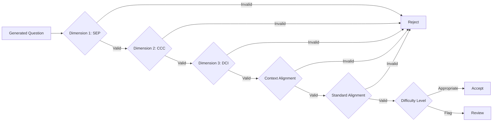

# Epic: Validation & Quality Assurance

**Epic ID**: CC-EPIC-003  
**Epic Name**: Validation & Quality Assurance  
**Project**: ClusterCraft  
**Status**: To Do  
**Priority**: Highest  
**Duration**: 3-4 weeks  

---

## Epic Description

Develop comprehensive validation framework to ensure generated questions meet all 3-dimensional learning requirements, align with standards, and match the quality of official Regents exam questions. Includes automated validation, expert review processes, and quality metrics.

---

## Epic Goals

1. Build automated 3D alignment validation system
2. Create standard alignment checker
3. Implement context appropriateness scoring
4. Design difficulty level classifier
5. Establish quality metrics and rubrics
6. Conduct expert review of generated questions
7. Iterate and improve based on feedback

---

## Acceptance Criteria

- [ ] Automated 3D alignment checker operational (>95% accuracy)
- [ ] Standard alignment validator confirms 100% alignment
- [ ] Context appropriateness scorer implemented
- [ ] Difficulty classifier matches Regents level
- [ ] Quality rubric created and validated by SMEs
- [ ] All 18 standards tested with generated questions
- [ ] Expert review shows >4.0/5.0 quality score
- [ ] Validation report generated for each question set

---

## Stories in This Epic

28. **CC-028**: Design validation framework architecture
29. **CC-029**: Build Dimension 1 (SEP) validator
30. **CC-030**: Build Dimension 2 (CCC) validator
31. **CC-031**: Build Dimension 3 (DCI) validator
32. **CC-032**: Create integrated 3D alignment checker
33. **CC-033**: Implement standard alignment validator
34. **CC-034**: Build context appropriateness scoring system
35. **CC-035**: Create difficulty level classifier
36. **CC-036**: Develop quality metrics dashboard
37. **CC-037**: Generate questions for all 18 standards (test suite)

---

## Dependencies

- **Prerequisite**: CC-EPIC-002 (AI model must be operational)
- Physics subject matter experts for review
- Sample clusters for quality comparison
- Validation dataset from Epic 1

---

## Validation Layers

---

## Quality Rubric

| Criteria | Weight | Target Score |
|----------|--------|--------------|
| 3D Alignment | 30% | 5/5 |
| Context Fit | 25% | 4.5/5 |
| Clarity | 20% | 4.5/5 |
| Difficulty | 15% | 4/5 |
| Authenticity | 10% | 4/5 |
| **Overall** | **100%** | **>4.0/5** |

---

## Risks

| Risk | Impact | Mitigation |
|------|--------|------------|
| Subjective quality assessment | High | Multiple expert reviewers, clear rubrics |
| Validation false positives | Medium | Iterative refinement, test with known good/bad examples |
| Expert availability | Medium | Schedule reviews in advance, use async review process |
| Validation bottleneck | Low | Automate as much as possible |

---

## Success Metrics

- 3D Alignment Accuracy: >95%
- Standard Alignment: 100%
- Context Appropriateness: >90%
- Expert Quality Score: >4.0/5.0
- False Positive Rate: <5%
- Validation Time: <5 seconds per question

---

## Testing Protocol

1. Generate 3 questions for each of 18 standards (54 total)
2. Run automated validation on all questions
3. Expert review of 20% sample (11 questions)
4. Compare against official sample clusters
5. Document failure patterns
6. Iterate on AI prompts and validation rules
7. Re-test until targets met

---

## Related Epics

- **Previous**: CC-EPIC-002 (AI Model Development)
- **Next**: CC-EPIC-004 (UI & Integration)

---

**Created**: November 20, 2025  
**Last Updated**: November 20, 2025  
**Owner**: TBD
