# AI-Driven Physics Test Question Generator - Project Plan

## Executive Summary

This project aims to develop an AI-powered system that generates high-quality, 3-dimensional test questions for NY State Regents Physics exams. The system will take a storyline stimulus and an array of Performance Expectation Standards (e.g., HS-PS-2-1, HS-PS-3-1) and automatically generate 1-3 test questions that assess students across all three reasoning dimensions as defined by the NYSSLS framework.

---

## Project Overview

### Problem Statement
Creating valid, standards-aligned physics test questions that assess students across three dimensions (Science & Engineering Practices, Cross-Cutting Concepts, and Disciplinary Core Ideas) is time-consuming and requires deep expertise in both physics content and assessment design.

### Solution
An AI system that:
1. Understands NYSSLS Performance Expectation Standards
2. Analyzes provided storyline stimuli
3. Generates contextually appropriate test questions
4. Ensures alignment with 3-dimensional learning requirements
5. Produces questions similar in quality to official Regents exam clusters

### Success Criteria
- Generate questions that align with specified Performance Expectations
- Questions must test all three dimensions simultaneously
- Questions should be contextually appropriate to the provided stimulus
- Output quality comparable to sample clusters in the repository
- System can handle all Physics Performance Expectations (19 standards across 5 domains)

---

## Repository Structure Analysis

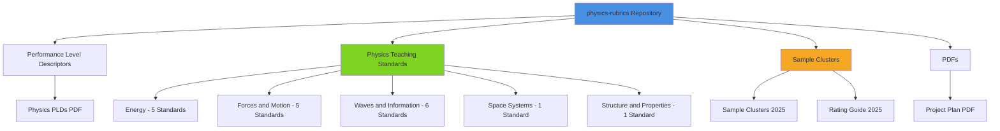

### Available Resources

| Resource Type | Location | Count | Purpose |
|--------------|----------|-------|---------|
| Performance Expectations | Physics Teaching Standards/ | 18 files | Detailed standard breakdowns |
| Sample Clusters | Sample Clusters/ | 3 clusters | Reference examples |
| Rating Guide | Sample Clusters/ | 1 guide | Grading rubrics |
| Performance Level Descriptors | Performance Level Descriptors/ | 1 PDF | Teaching requirements |
| Standards Overview | Physics Teaching Standards/ | 1 PDF | Complete standards document |

---

## Three-Dimensional Learning Framework

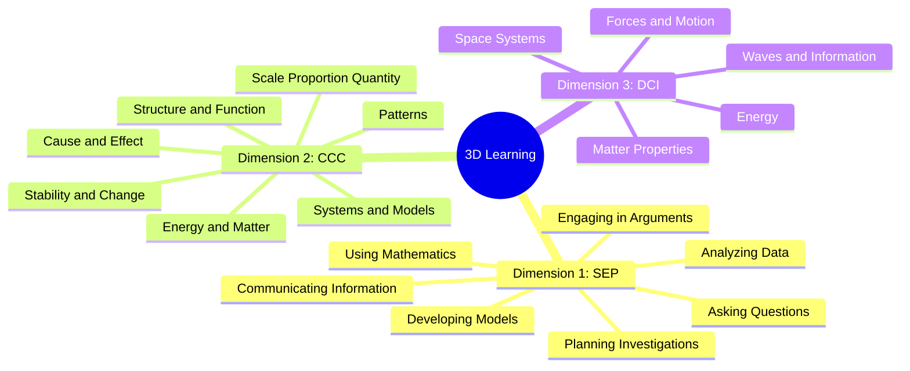

---

## System Architecture

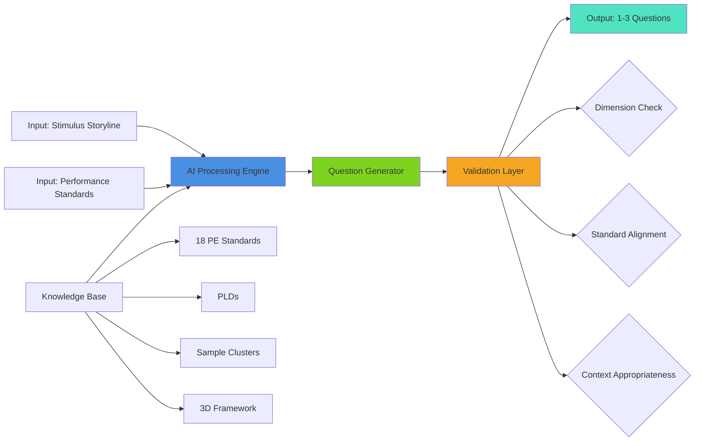

---

## Data Processing Pipeline

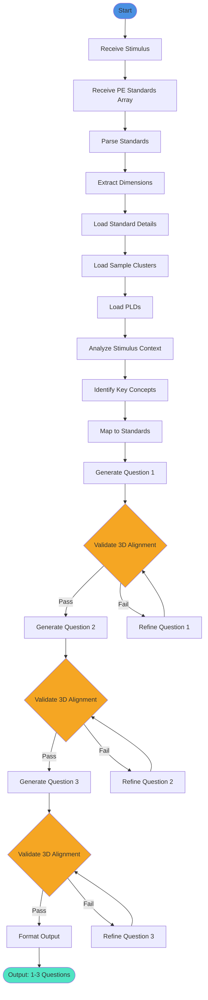

---

## Implementation Phases

### Phase 1: Data Preparation & Knowledge Base Construction
**Duration:** 2-3 weeks

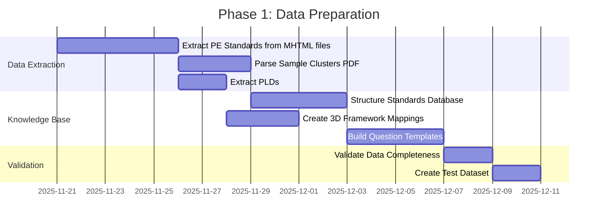

**Tasks:**
1. **Extract Performance Expectation Standards**
   - Parse 18 MHTML files from Physics Teaching Standards folder
   - Extract: Standard ID, Description, SEP requirements, CCC requirements, DCI content
   - Store in structured format (JSON/Database)

2. **Process Sample Clusters**
   - Extract 3 sample clusters from PDF
   - Analyze question structure and patterns
   - Identify 3D alignment in existing questions
   - Create question templates

3. **Build Knowledge Base**
   - Create searchable database of all standards
   - Map relationships between standards
   - Index by: Domain, SEP, CCC, DCI
   - Create cross-reference tables

4. **Deliverables:**
   - Structured standards database
   - Question pattern library
   - 3D framework mapping document
   - Data validation report

---

### Phase 2: AI Model Development
**Duration:** 4-6 weeks

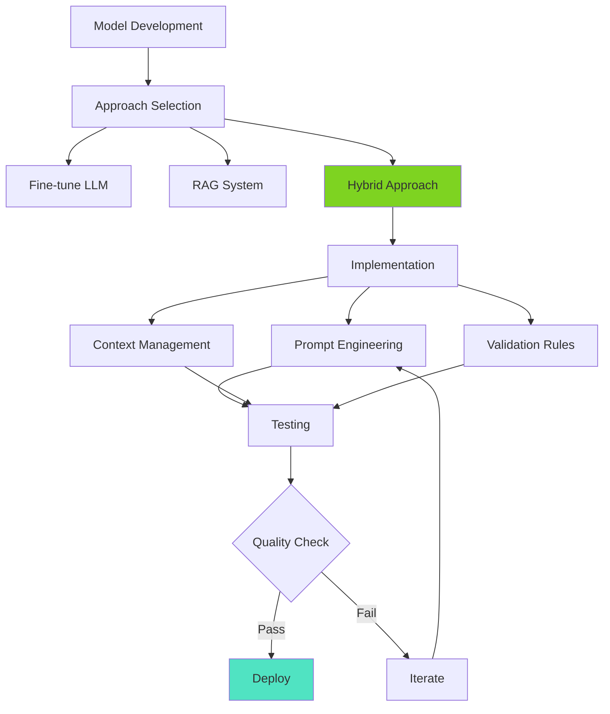

**Tasks:**
1. **Model Selection & Setup**
   - Evaluate LLM options (GPT-4, Claude 3.5, Gemini 3.0)
   - Set up RAG (Retrieval-Augmented Generation) architecture
   - Configure embedding models for standards search

   **LLM Evaluation Matrix:**
   
   | Model | Reasoning | Multimodal | Context Window | Cost | Best For |
   |-------|-----------|------------|----------------|------|----------|
   | **Gemini 3.0 Pro** | ⭐⭐⭐⭐⭐ | ⭐⭐⭐⭐⭐ | 2M tokens | $$ | Multimodal understanding, complex reasoning |
   | **Gemini 3.0 Deep Think** | ⭐⭐⭐⭐⭐ | ⭐⭐⭐⭐⭐ | 2M tokens | $$$ | Complex multi-step problems, advanced reasoning |
   | **Claude 3.5 Sonnet** | ⭐⭐⭐⭐⭐ | ⭐⭐⭐⭐ | 200K tokens | $$$ | Long-form reasoning, instruction following |
   | **GPT-4 Turbo** | ⭐⭐⭐⭐ | ⭐⭐⭐⭐ | 128K tokens | $$$ | General purpose, reliable |
   | **Gemini 2.0 Flash** | ⭐⭐⭐⭐ | ⭐⭐⭐⭐⭐ | 1M tokens | $ | Speed, cost-effective multimodal |

   **Recommendation:** **Gemini 3.0 Pro** or **Gemini 3.0 Deep Think**
   
   *Rationale:* 
   - Released November 18, 2025, Gemini 3.0 is Google's most intelligent model to date
   - **Best-in-class multimodal understanding** - can process text, images, diagrams, and graphs simultaneously (critical for physics problems)
   - **Enhanced reasoning capabilities** - excels at complex, multi-step problem solving
   - **Large context window (2M tokens)** - can process entire standards documents and sample clusters
   - **Agentic capabilities** - better at following complex instructions and planning
   - **Deep Think variant** - specifically designed for complex reasoning tasks like question generation
   - **Cost-effective** - competitive pricing with superior performance
   - **Native integration** - available via Google AI Studio and Vertex AI
   
   *Alternative:* Claude 3.5 Sonnet remains excellent for pure text-based reasoning and instruction following

2. **Prompt Engineering**
   - Design system prompts for question generation
   - Create few-shot examples from sample clusters
   - Develop dimension-specific validation prompts
   - Build context templates

3. **Integration Development**
   - Connect to knowledge base
   - Implement standards retrieval
   - Build context injection system
   - Create output formatting

4. **Deliverables:**
   - Trained/configured AI model
   - Prompt library
   - API integration layer
   - Initial test results

---

### Phase 3: Validation & Quality Assurance
**Duration:** 3-4 weeks

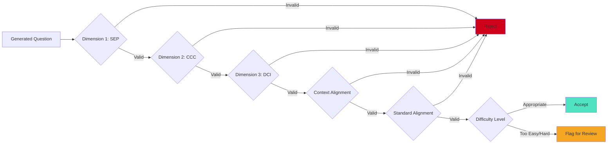

**Tasks:**
1. **Develop Validation Framework**
   - Create automated 3D alignment checker
   - Build standard alignment validator
   - Implement context appropriateness scorer
   - Design difficulty level classifier

2. **Quality Metrics**
   - Define success criteria for each dimension
   - Create rubric based on sample clusters
   - Establish inter-rater reliability measures
   - Set acceptance thresholds

3. **Testing Protocol**
   - Generate questions for all 18 standards
   - Expert review of generated questions
   - Compare against sample clusters
   - Iterate based on feedback

4. **Deliverables:**
   - Validation framework
   - Quality metrics dashboard
   - Test results report
   - Improvement recommendations

---

### Phase 4: User Interface & Integration
**Duration:** 2-3 weeks

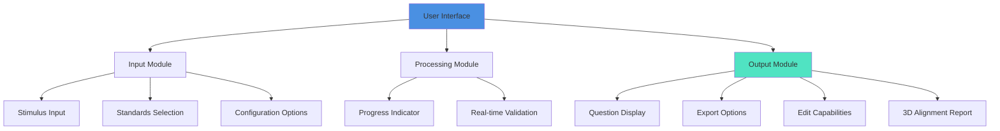

**Tasks:**
1. **Interface Design**
   - Create input form for stimulus
   - Build standards selector (multi-select from 18 options)
   - Design question display/editing interface
   - Add export functionality (PDF, Word, JSON)

2. **Integration Features**
   - Batch processing capability
   - Save/load functionality
   - Version control for questions
   - Collaboration features

3. **Documentation**
   - User guide
   - API documentation
   - Best practices guide
   - Troubleshooting guide

4. **Deliverables:**
   - Functional UI/API
   - User documentation
   - Integration examples
   - Training materials

---

## Technical Specifications

### Input Format

```json
{
  "stimulus": {
    "title": "Roller Coaster Energy",
    "description": "A roller coaster car with mass 500 kg starts from rest at point A, 30 meters above the ground...",
    "context_type": "real_world_scenario",
    "includes_visuals": true,
    "visual_types": ["diagram", "graph"]
  },
  "performance_expectations": [
    "HS-PS3-1",
    "HS-PS3-2",
    "HS-PS2-1"
  ],
  "question_count": 3,
  "difficulty_level": "regents_standard",
  "options": {
    "include_calculations": true,
    "include_explanations": true,
    "question_types": ["multiple_choice", "constructed_response"]
  }
}
```

### Output Format

```json
{
  "questions": [
    {
      "question_id": "Q1",
      "question_text": "At which point does the roller coaster car have the maximum kinetic energy?",
      "question_type": "multiple_choice",
      "options": [
        "Point A (top of first hill)",
        "Point B (bottom of first valley)",
        "Point C (top of second hill)",
        "Point D (end of ride)"
      ],
      "correct_answer": "B",
      "explanation": "Kinetic energy is maximum when potential energy is minimum...",
      "dimensions": {
        "sep": ["Analyzing Data", "Using Mathematics"],
        "ccc": ["Energy and Matter", "Systems and Models"],
        "dci": "PS3.A: Definitions of Energy"
      },
      "standards_addressed": ["HS-PS3-1", "HS-PS3-2"],
      "difficulty": "medium",
      "bloom_level": "apply"
    }
  ],
  "metadata": {
    "generation_timestamp": "2025-11-20T22:52:30Z",
    "model_version": "1.0",
    "validation_score": 0.95,
    "alignment_report": {
      "dimension_1_coverage": 1.0,
      "dimension_2_coverage": 1.0,
      "dimension_3_coverage": 1.0,
      "context_alignment": 0.92
    }
  }
}
```

---

## Performance Expectations Coverage

### Domain Breakdown

| Domain | Standards | Files in Repo |
|--------|-----------|---------------|
| Energy | HS-PS3-1 through HS-PS3-5 | 5 MHTML files |
| Forces and Motion | HS-PS2-1 through HS-PS2-5 | 5 MHTML files |
| Waves and Information | HS-PS4-1 through NY HS-PS4-6 | 6 MHTML files |
| Space Systems | HS-ESS1-2 | 1 MHTML file |
| Structure and Properties of Matter | HS-PS1-8 | 1 MHTML file |

**Total: 18 Performance Expectations**

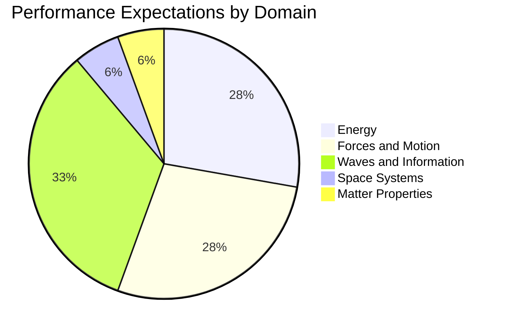

---

## Risk Assessment & Mitigation

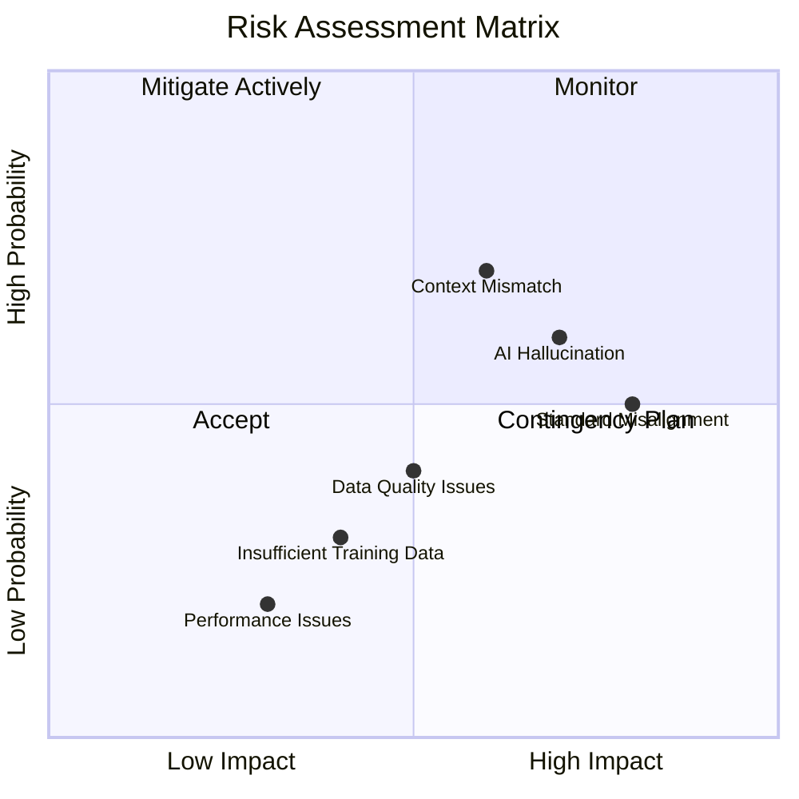

### Key Risks & Mitigation Strategies

| Risk | Probability | Impact | Mitigation Strategy |
|------|------------|--------|---------------------|
| AI generates invalid questions | Medium | High | Multi-layer validation, expert review |
| Misalignment with standards | Medium | High | Automated alignment checking, template-based generation |
| Poor context integration | High | Medium | RAG system with strong retrieval, context validation |
| Insufficient sample data | Low | Medium | Augment with additional Regents exam questions |
| Performance/cost issues | Low | Low | Optimize prompts, cache common queries |

---

## Technology Stack Recommendations

### Core Components

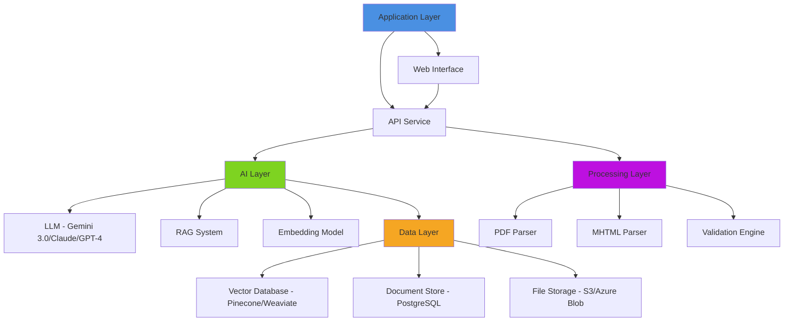

### Recommended Technologies

| Component | Technology Options | Recommendation |
|-----------|-------------------|----------------|
| **LLM** | Gemini 3.0 Pro, Claude 3.5, GPT-4 | **Gemini 3.0 Pro** (best multimodal + reasoning) |
| **Vector DB** | Pinecone, Weaviate, Chroma | Weaviate (open source, flexible) |
| **Backend** | Python FastAPI, Node.js | Python FastAPI (AI ecosystem) |
| **Frontend** | React, Vue, Svelte | React (ecosystem maturity) |
| **Database** | PostgreSQL, MongoDB | PostgreSQL (structured data) |
| **PDF Processing** | PyPDF2, pdfplumber | pdfplumber (better table extraction) |
| **MHTML Processing** | BeautifulSoup, lxml | BeautifulSoup (easier parsing) |

---

## Development Workflow

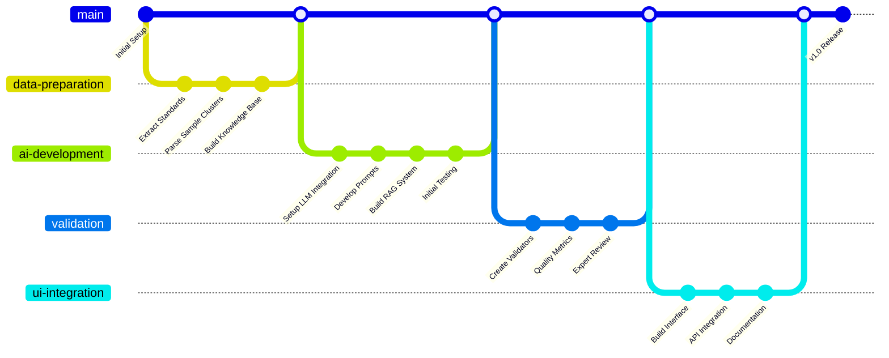

---

## Success Metrics

### Quantitative Metrics

| Metric | Target | Measurement Method |
|--------|--------|-------------------|
| 3D Alignment Accuracy | >95% | Automated validation + expert review |
| Standard Alignment | 100% | Automated checking against PE requirements |
| Context Appropriateness | >90% | Expert scoring (1-5 scale) |
| Generation Time | <30 seconds | System performance monitoring |
| Question Quality Score | >4.0/5.0 | Expert panel rating |
| Dimension Coverage | 100% | Automated dimension checker |

### Qualitative Metrics

- Questions are indistinguishable from human-written questions
- Teachers find questions useful for assessment
- Questions align with Regents exam difficulty
- Questions promote 3-dimensional thinking
- Stimuli are engaging and realistic

---

## Project Timeline

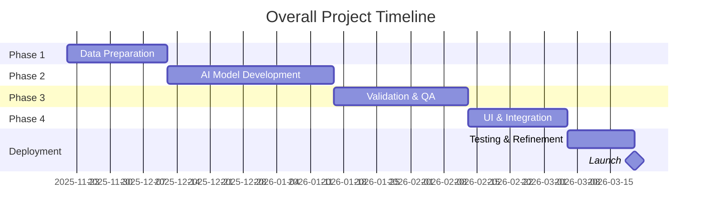

**Total Duration:** Approximately 4-5 months

---

## Budget Considerations

### Estimated Costs

| Category | Item | Estimated Cost |
|----------|------|----------------|
| **AI Services** | LLM API calls (development) | $500-1,000 |
| **AI Services** | LLM API calls (production/month) | $200-500 |
| **Infrastructure** | Vector database hosting | $50-100/month |
| **Infrastructure** | Application hosting | $50-100/month |
| **Development** | Developer time (if outsourced) | Variable |
| **Tools** | PDF processing, analytics | $50-100/month |

**Total Initial Investment:** $1,000-2,000  
**Monthly Operating Cost:** $350-800

---

## Next Steps

### Immediate Actions (Week 1)

1. **Set up development environment**
   - Create project repository structure
   - Install required dependencies
   - Set up version control

2. **Begin data extraction**
   - Write scripts to parse MHTML files
   - Extract standards from Physics Teaching Standards folder
   - Create initial database schema

3. **Analyze sample clusters**
   - Manual review of 3 sample clusters
   - Document question patterns
   - Identify 3D alignment strategies

4. **Select AI platform**
   - Test API access for chosen LLM
   - Set up RAG infrastructure
   - Create initial prompts

### Week 2-3 Actions

1. **Complete knowledge base**
   - Finish standards extraction
   - Build cross-reference tables
   - Create searchable index

2. **Develop initial prototype**
   - Create basic question generator
   - Test with sample stimuli
   - Iterate on prompts

3. **Build validation framework**
   - Implement dimension checkers
   - Create alignment validators
   - Set up quality scoring

---

## Appendix

### A. Sample Question Structure

Based on analysis of sample clusters, questions should follow this structure:

**Multiple Choice:**
- Clear, concise question stem
- 4 answer options (A-D)
- One correct answer
- Distractors based on common misconceptions
- Requires application of multiple concepts

**Constructed Response:**
- Open-ended question
- Requires explanation/justification
- Tests deeper understanding
- Allows for multiple solution paths
- Includes scoring rubric

### B. Standards Reference Format

Each Performance Expectation includes:
- **Standard ID:** HS-PS3-1
- **Statement:** What students should be able to do
- **SEP:** Which science practices are required
- **DCI:** Which core ideas are addressed
- **CCC:** Which cross-cutting concepts apply
- **Clarification Statement:** Additional context
- **Assessment Boundary:** What NOT to assess

### C. Question Quality Rubric

| Criteria | Score 1 | Score 3 | Score 5 |
|----------|---------|---------|---------|
| 3D Alignment | Missing 2+ dimensions | All 3 present but weak | Strong integration of all 3 |
| Context Fit | Unrelated to stimulus | Loosely related | Directly builds on stimulus |
| Clarity | Ambiguous or confusing | Mostly clear | Crystal clear |
| Difficulty | Too easy or too hard | Slightly off | Appropriate for Regents |
| Authenticity | Artificial scenario | Somewhat realistic | Highly authentic |

---

## Conclusion

This project represents a significant opportunity to leverage AI for educational assessment. By combining the structured NYSSLS framework with modern AI capabilities, we can create a tool that:

1. **Saves time** for educators creating assessments
2. **Ensures quality** through automated validation
3. **Maintains standards** alignment across all questions
4. **Promotes 3D learning** by design
5. **Scales efficiently** across all physics domains

The phased approach allows for iterative development and continuous improvement based on expert feedback. With proper implementation, this system can become an invaluable resource for physics educators across New York State and beyond.

---

**Document Version:** 1.0  
**Created:** November 20, 2025  
**Author:** AI Project Planning System  
**Status:** Draft for Review
