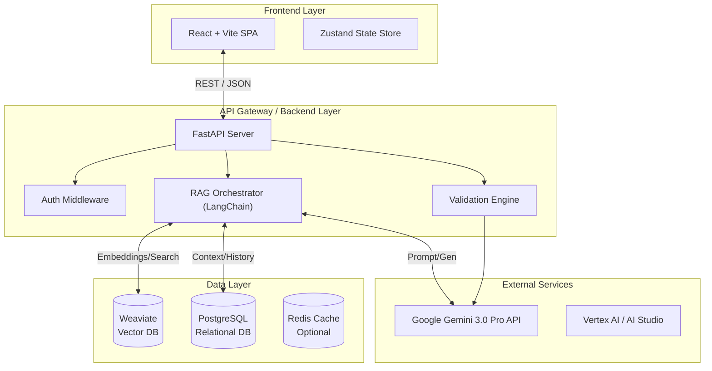
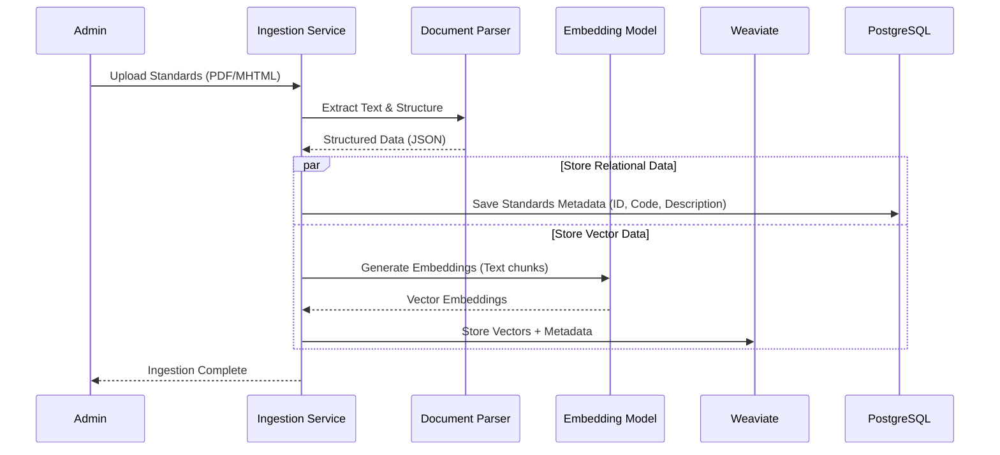
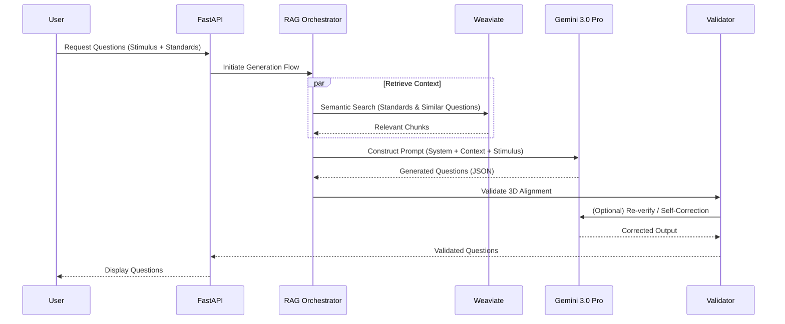

# AI-Driven Physics Test Question Generator - Technical Architecture & Roadmap

## 1. Executive Summary

This document outlines the technical architecture for the AI-Driven Physics Test Question Generator. The system is designed as a modern web application leveraging a microservices-inspired architecture. It utilizes a React-based frontend for user interaction, a Python FastAPI backend for business logic and orchestration, and a robust data layer combining PostgreSQL for relational data and Weaviate for vector embeddings. The core intelligence is powered by Google's Gemini 3.0 Pro model, integrated via a Retrieval-Augmented Generation (RAG) pipeline to ensure strict adherence to NY State Physics Standards.

---

## 2. System Architecture

### 2.1 High-Level Architecture

### 2.2 Data Flow: Ingestion Pipeline (Phase 1)

This pipeline processes raw standards and sample clusters into the knowledge base.

### 2.3 Data Flow: Question Generation (Phase 2)

---

## 3. Technology Stack Details

### 3.1 Frontend
- **Framework**: **React 18+** with **Vite** (Fast build tool, modern DX).
- **Language**: **TypeScript** (Strict typing for reliability).
- **Styling**: **Tailwind CSS** (Utility-first, rapid UI development) + **Shadcn/UI** (Accessible, customizable components).
- **State Management**: **Zustand** (Lightweight, simple state) or **React Query** (Server state/caching).
- **Form Handling**: **React Hook Form** + **Zod** (Schema validation).

### 3.2 Backend
- **Framework**: **FastAPI** (Python). chosen for high performance, native async support, and easy integration with AI libraries.
- **Language**: **Python 3.11+**.
- **Orchestration**: **LangChain** or **LlamaIndex** (Frameworks for building RAG applications).
- **Validation**: **Pydantic** (Data validation and settings management).
- **Server**: **Uvicorn** (ASGI server).

### 3.3 Database
- **Relational**: **PostgreSQL** (v15+). Stores user data, project metadata, question history, and strict standard definitions.
- **Vector**: **Weaviate** (or Pinecone). Stores embeddings of standards, PLDs, and sample clusters for semantic retrieval.
- **Caching (Optional)**: **Redis**. For caching frequent API responses or standard lookups.

### 3.4 AI / LLM
- **Model**: **Google Gemini 3.0 Pro**.
    - *Reasoning*: Best-in-class multimodal capabilities (essential for physics diagrams), huge context window (2M tokens), and strong reasoning for complex physics problems.
- **Runtime API Provider**: **Google AI Studio API** or **Vertex AI**.
    - *Note*: This is required for the deployed application to access Gemini models programmatically, distinct from the AntiGravity IDE used for development.
- **Embeddings**: **Gecko** (Google's text-embedding model) or **OpenAI text-embedding-3-small** (depending on benchmark results for technical physics content).

### 3.5 Development Environment
- **IDE**: **Google AntiGravity** (New release Nov 2025).
    - *Role*: Primary development tool for building the application.
    - *Benefits*: 
        - **Agent-First Architecture**: Accelerates implementation of complex logic (RAG pipeline, validation) via autonomous agents.
        - **Gemini 3.0 Pro Native**: The IDE runs on the same model family as the target application, ensuring prompt/logic compatibility.
        - **Artifact-Based Workflow**: Generates and maintains documentation (like this architecture doc) and code simultaneously.
    - *Integration*: Uses the same underlying Gemini models, allowing for seamless testing of prompts within the IDE before deploying to the application's codebase.

---

## 4. Data Model

### 4.1 Relational Schema (Simplified)

**Standards Table**
- `id`: UUID
- `code`: String (e.g., "HS-PS3-1")
- `domain`: String (e.g., "Energy")
- `description`: Text
- `sep_ids`: Array[UUID] (Foreign Keys to SEP table)
- `ccc_ids`: Array[UUID] (Foreign Keys to CCC table)
- `dci_ids`: Array[UUID] (Foreign Keys to DCI table)

**Stimuli Table**
- `id`: UUID
- `title`: String
- `content`: Text (Markdown)
- `image_urls`: Array[String]
- `created_at`: Timestamp

**Questions Table**
- `id`: UUID
- `stimulus_id`: UUID (FK)
- `standard_ids`: Array[String]
- `question_text`: Text
- `question_type`: Enum (MC, ShortAnswer)
- `options`: JSONB (for MC)
- `correct_answer`: Text
- `explanation`: Text
- `ai_metadata`: JSONB (Model version, prompt used, confidence score)

### 4.2 Vector Schema (Weaviate Class)

**StandardChunk**
- `content`: Text (The actual text of the standard/PLD)
- `source_document`: String (Filename)
- `chunk_index`: Int
- `vector`: Float[] (The embedding)
- `metadata`: Object (Standard Code, Domain, Keywords)

---

## 5. API Design

### 5.1 Endpoints

**Standards**
- `GET /api/v1/standards`: List all available standards.
- `GET /api/v1/standards/{id}`: Get details for a specific standard.
- `POST /api/v1/standards/ingest`: Trigger ingestion pipeline (Admin only).

**Generation**
- `POST /api/v1/generate`: Main generation endpoint.
    - **Body**: `{ stimulus: ..., standard_ids: [...], config: ... }`
    - **Response**: `{ questions: [...], metadata: ... }`

**Validation**
- `POST /api/v1/validate`: Standalone validation endpoint for manually drafted questions.

---

## 6. Technical Implementation Roadmap

### Phase 1: Foundation & Data Ingestion (Weeks 1-3)

1.  **Repo Setup**:
    - [ ] Initialize Git repository with `frontend/` and `backend/` structure.
    - [ ] Configure Docker Compose for local dev (Postgres, Weaviate, API).
    - [ ] Set up pre-commit hooks (Black, ESLint).

2.  **Database Initialization**:
    - [ ] Design PostgreSQL schema (SQLAlchemy/SQLModel models).
    - [ ] Configure Weaviate schema (Classes and properties).
    - [ ] Run initial migrations.

3.  **Ingestion Service**:
    - [ ] Implement PDF/MHTML parsers (using `BeautifulSoup` / `pdfplumber`).
    - [ ] Create "Chunking Strategy" for standards documents.
    - [ ] Implement embedding generation script.
    - [ ] **Milestone**: Successfully query Weaviate for "Conservation of Energy" and get relevant standard chunks.

### Phase 2: AI Core & RAG Pipeline (Weeks 4-7)

4.  **LLM Integration**:
    - [ ] Set up Google AI Studio API key management.
    - [ ] Create basic "Hello World" prompt wrapper for Gemini.

5.  **RAG Orchestrator**:
    - [ ] Implement `Retriever` class to fetch context from Weaviate based on user query/standards.
    - [ ] Design `PromptTemplate` for Question Generation (System Prompt + Few-Shot Examples).
    - [ ] Build the main `GenerationChain` (Retrieve -> Augment -> Generate).

6.  **Validation Logic**:
    - [ ] Implement "Self-Correction" loop: Parse JSON output -> Check structure -> Retry if malformed.
    - [ ] **Milestone**: Generate a valid JSON question object from a text stimulus.

### Phase 3: API & Frontend MVP (Weeks 8-10)

7.  **API Development**:
    - [ ] Expose RAG pipeline via FastAPI endpoints.
    - [ ] Add error handling and logging.

8.  **Frontend Construction**:
    - [ ] Scaffold React app with Vite + Tailwind.
    - [ ] Create "Configuration Panel" (Select Standards, Input Stimulus).
    - [ ] Create "Results View" (Render generated questions, Markdown support).
    - [ ] Connect Frontend to Backend API.

### Phase 4: Refinement & Polish (Weeks 11+)

9.  **Advanced Validation**:
    - [ ] Implement specific checks for 3D alignment (e.g., "Does this question actually require a calculation?").

10. **UI Enhancements**:
    - [ ] Add "Export to PDF" feature.
    - [ ] Add "Edit Question" mode.

11. **Deployment**:
    - [ ] Create Dockerfile for production.
    - [ ] Deploy to cloud provider (e.g., Google Cloud Run).
