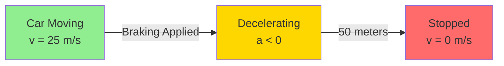
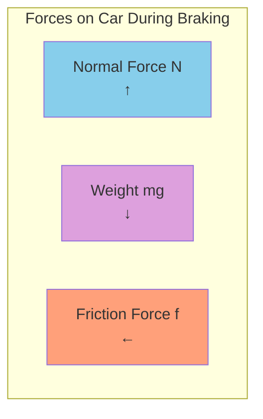

# Car Braking Scenario

## Situation

A 1000 kg car is traveling at 25 m/s on a wet pavement when the driver applies the brakes. The car comes to a complete stop after traveling 50 meters.

## Given Information

- Mass of car: m = 1000 kg
- Initial velocity: v₀ = 25 m/s
- Final velocity: v = 0 m/s
- Stopping distance: d = 50 m
- Coefficient of friction (wet pavement): μ = 0.3

## Motion Diagram

## Force Diagram

## Velocity vs. Time Data

| Time (s) | Velocity (m/s) | Position (m) | Acceleration (m/s²) |
|----------|----------------|--------------|---------------------|
| 0.0      | 25.0           | 0.0          | 0.0                 |
| 1.0      | 20.0           | 22.5         | -5.0                |
| 2.0      | 15.0           | 40.0         | -5.0                |
| 3.0      | 10.0           | 52.5         | -5.0                |
| 4.0      | 5.0            | 60.0         | -5.0                |
| 5.0      | 0.0            | 62.5         | -5.0                |

## Additional Context

The coefficient of friction between the wet pavement and the tires is approximately 0.3. The driver's reaction time before applying the brakes was 0.5 seconds.
